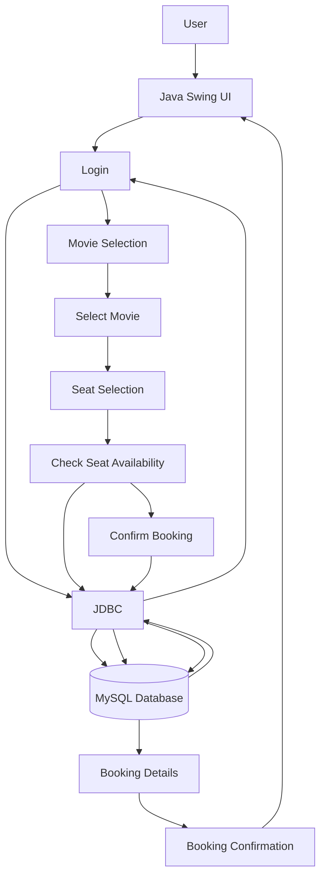

# Movie Booking System

A desktop-based Movie Booking System developed using Java Swing, JDBC, and MySQL. The application allows users to log in, select movies, book seats, and view booking confirmations.

## Technologies Used

* Java
* Java Swing
* JDBC
* MySQL

## Features

* User Login Authentication
* Movie Selection
* Seat Booking
* Booking Confirmation
* Dynamic Movie Posters and Backgrounds
* MySQL Database Integration
* User-friendly Swing Interface

## Project Highlights

This project helped me gain practical experience in Java Swing, JDBC, MySQL database connectivity, GUI development, event handling, and debugging.

During development, I worked through real-world issues such as database connection errors, classpath problems, image resource loading, UI design issues, and page navigation bugs.

## How to Run

1. Clone the repository.
2. Open the project in IntelliJ IDEA or VS Code.
3. Create the required MySQL database.
4. Update the database username, password, and connection details.
5. Add the MySQL JDBC driver.
6. Run the main Java class.

## Future Improvements

* Booking history
* Ticket cancellation
* Admin dashboard
* Movie search and filtering
* Online payment integration
* Improved UI and animations

  ## System Flow

## Author

Dhanush Nayak
